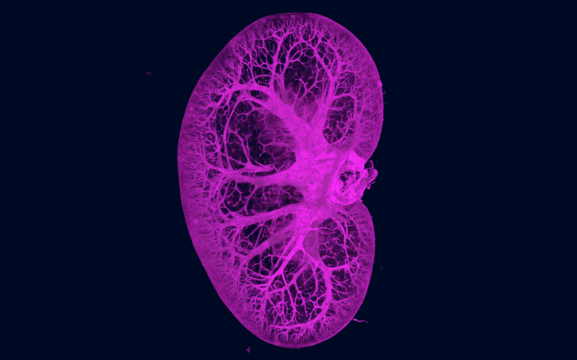

# Transcriptomic (RNA-Seq) Analysis of Renal Fibrosis in SMOC2-Overexpressing Mice (WIP)

---

---

## Background:

- Chronic kidney disease (CKD) is a heterogenous disease that refers to any abnormalities in the structure of function of the kidneys that is present for more than 3 months. A hallmark of CKD is tubulo-interstitial injury that leads to a surplus of extracellular matrix (ECM) protein deposition leading to fibrosis and scarring. The mechanisms underlying kidney fibrosis are complicated and still under investigation. However, recent advances in sequencing technologies and the emergence of the omics era have enabled researchers to answer many questions surrounding this topic, thereby facilitating the discovery of fibrotic injury biomarkers and the identification of antifibrotic therapeutic targets.
  
- Secreted modular calcium-binding protein 2 (SMOC2) is a protein belonging to the Secreted Protein Acidic and Rich in Cysteine (SPARC) matricellular protein family. It is secreted in the extracellular space and interact with a variety of bioactive effectors including structural matrix proteins, cell surface receptors, growth factors, and proteases. It serves to regulate cell-matrix interactions and cell functions. SMOC2 is mainly secreted in the kidneys, lungs, ovaries, and skeletal muscles. Owing to its role in triggering the fibroblast-to-myofibroblast transition (FMT), SMOC2 has been implicated in the progression of fibrotic disorders. However, the mechanisms underlying SMOC2's involvement in initiating fibrosis have yet to be fully uncovered, making it a target of interest in the study of fibrotic disorder intiation and progression.

## About the dataset:

- **GEO accession:** [GSE85209](https://www.ncbi.nlm.nih.gov/geo/query/acc.cgi?acc=GSE85209)
- **Organism:** *Mus musculus*
- **Model:** Unilateral ureteral obstruction (UUO)
- **Samples:** 7 SMOC2-overexpressing samples (3 normal, 4 UUO/fibrosis)
- **Data type:** Raw counts, Ensembl gene IDs
- **Original study:** https://insight.jci.org/articles/view/90299

## Goal of the analysis:

- The aim of this project is to investigate how induction of SMOC2 in kidneys affect the progression of kidney fibrosis and to identify affected genes and biological pathways associated with fibrosis.

## Workflow:

### Data collection:

- GSE85209 was downloaded from the GEO accession viewer, unzipped, then merged into a count matrix. Wild type samples were discarded, as only the SMOC2 samples were relevant for this analysis. The final matrix contained 3 normal (control) samples, and 4 treated (SMOC2 UUO) samples.

### Quality control:

- Size factors were estimated and used for normalization via DESeq2. Variance stabilizing transformation (VST) was applied blind to experimental condition. A sample correlation heatmap was generated to assess inter-sample similarity. Then, Principal Component Analysis (PCA) was performed on VST-transformed counts to confirm separation by condition. Lastly, Dispersion estimates were plotted to verify model fit prior to differential expression testing.

### Differential expression analysis (DEA):

- DESeq2 was used with `smoc2_normal` as the reference level. Results were extracted for the contrast fibrosis vs. normal with α = 0.05 and a log2 fold change (LFC) threshold of 0.32. Log2 fold changes were shrunk using the `apeglm` method to reduce noise from low-count genes. Adjusted p-values (FDR) were computed using the Benjamini-Hochberg (BH) method. Significant DEGs were defined as *p adj.* < 0.05.

### Functional enrichment analysis / Overrepresentation analysis (ORA):

- Overrepresentation analysis was performed on significant DEGs using `clusterProfiler` for all three gene ontology (GO) categories: Biological Process (BP), Molecular Function (MF), and Cellular Component (CC). As well as KEGG pathway enrichment analysis. Results were visualized as dotplots, barplots, and enrichment maps

### Gene-set enrichment analysis (GSEA):

- GSEA was performed on the full ranked gene list (ranked by log2FoldChange) using `gseKEGG` to detect coordinated pathway-level shifts independent of a significance threshold. Results were visualized as dotplots and ridge plots.

## Results:

### Quality control:

- The heatmap shows clean separation between the normal and fibrosis groups. Normal samples (red) correlate highly with each other and fibrosis samples (blue) correlate highly with each other, and the two groups are clearly distinct. All correlations are above 0.96, denoting good sample quality with no obvious outliers.

- PC1 captures 93% of the variance and separates fibrosis from normal samples along the horizontal axis.

  
### DEA:

- The dispersion plot shows that gene-wise estimates (black dots) decrease as mean expression increases, and they cluster tightly around the fitted line (red). The final shrunken estimates (blue) follow the trend closely, indicating appropriate DESeq2 model fit.

- DE analysis yielded 7563 DEGs, of which 4011 were upregulated and 3552 were downregulated.

- Significant DEGs (blue) are distributed across the full range of expression. Low-count genes have their fold changes pulled toward zero (the band near LFC=0 at low mean counts). Significant genes are spread across both moderate and high expression levels.

- The heatmap of significant DEGs shows two clear gene clusters, one strongly upregulated in fibrosis (magenta in fibrosis samples, lavender in normal samples), and one strongly downregulated (lavender in fibrosis, magenta in normal). The sample clustering clusters normal samples from fibrosis samples properly, indicating a strong differential expression signal.

### Enrichment analysis:

### GSEA:

## Interpretation:

## Tools and packages used:

- R/Bioconductor & RStudio
- DESeq2
- RColorBrewer
- pheatmap
- tidyverse
- apeglm
- clusterProfiler
- org.Mm.eg.db  
- enrichplot

## Acknowledgement:

- This project was completed as part of my RNA-seq learning journey and was inspired by concepts and workflows introduced in the DataCamp course ["RNA-Seq with Bioconductor in R"](https://app.datacamp.com/learn/courses/rna-seq-with-bioconductor-in-r). Portions of the analysis structure and some code elements (largely in the differential expression analysis part) were adapted from course exercises and instructional materials for educational purposes. The transcriptomic analysis, downstream analyses, and interpretation were conducted as a public reanalysis project.

## References:

1. JCI Insight. 2017;2(8):e90299. https://doi.org/10.1172/jci.insight.90299.
2. Huang, R., Fu, P. & Ma, L. Kidney fibrosis: from mechanisms to therapeutic medicines. Sig Transduct Target Ther 8, 129 (2023). https://doi.org/10.1038/s41392-023-01379-7
3. Xin C, Lei J, Wang Q. Therapeutic silencing of SMOC2 prevents kidney function loss in mouse model of chronic kidney disease, iScience, 2021; 24. https://www.cell.com/iscience/fulltext/S2589-0042(21)01161-5
4. Rui H, Zhao F, Yuhua L and Hong J (2023) Suppression of SMOC2 alleviates myocardial fibrosis via the ILK/p38 pathway. Front. Cardiovasc. Med. 9:951704. doi: 10.3389/fcvm.2022.951704
